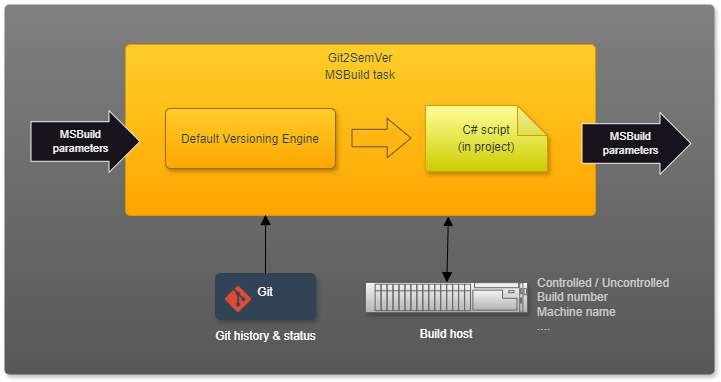

---
uid: default-versioning
---

<div style="background-color:#944248;padding:0px;margin-bottom:0.5em">
  
</div>

[](https://www.nuget.org/packages/NoeticTools.Git2SemVer.Tool)
<a href="https://github.com/NoeticTools/Git2SemVer">
  
</a>

# Default versioning

Git2SemVer generates [versioning information](xref:NoeticTools.Git2SemVer.MSBuild.Versioning.Generation.IVersionOutputs) using its in-built default versioning builder.
These versions are then made available to the optional [C# script](xref:csharp-script) for modification before being passed back to the build.



## Marking releases

Semantic versioning talks about releases. Versions are bumped after a release.
A release is identified by placing a [Git release version tag](xref:git2semver-release-version-tag) (like `v1.2.3`) on the commit used by the build being released.

## Build ID

A [build ID](xref:glossary#build-id) is determined for each [build host](xref:build-hosts).
This allows for handling build hosts/systems that may not provide a [build number](xref:glossary#build-number) and or where there are multiple build number contexts (such as dev boxes).

Example build ID shemas (using [build host](xref:build-hosts) build number and build context properties):

* `<build number>`  - Used on the project's production build system host (e.g: [TeamCity](xref:teamcity)) when the build system provides a [build number](xref:glossary#build-number).
* `<build context>.<build number>` - Useful for [uncontrolled hosts](xref:uncontrolled-host) where the build context is the host machine's name.
* `<build number>.<build context>` - Useful when a host provides a psuedo build number ([build ID](xref:glossary#build-id)) and context is required to achive traceability. See [GitHub worfklow](xref:github-workflows) host.

See the [build host](xref:build-hosts) type for details.

## Branch name

The branch name included in version metadata has any [invalid Semmmantic Versioning characters](https://semver.org/#spec-item-10) replaced with "-".
This is to ensure Semmmantic Versioning compliance and compatibility with common tools.

## Commit SHA

The full commit SHA is used rather than a short version to maintain consistency and compatibility with [SourceLink related changes in .NET SDK 8](https://learn.microsoft.com/en-us/dotnet/core/compatibility/sdk/8.0/source-link).

## Maturity identifier

The first identifier in a version's prelease identifiers is always the maturity label like `alpha` or `beta`.
The maturity is derived from the branch name (see [Git2SemVer_BranchMaturityPattern](xref:msbuild-properties)).

The default settings are (first match from top is used):

| Maturity | Regex                                     | Matching examples  |
| :---:    |:---                                       |:---                |
| Release  | `^(main|release)[\\/_]?`                  | `main`, `release`, `release/release_name` |
| RC       | `^(?<rc>(main|release)[\\/_]rc.*)[\\/_]?` | `main/rc`, `release/rc5`  |
| Beta     | `^(feature)[\\/_]?`                       | `feature`, `feature/feature_name`  |
| Alpha    | `^((.+))[\\/_]?`                          | `dev/MyBranch`, `tom` |

# Schema

## Release versioning

Format:

```
  <major>.<minor>.<patch>[+<build-id>.<branch>.<commit-sha>]
```

| Use                   | Schema                                           |
|:---                   |:---                                              |
| Build system          | `1.2.3+<build-id>`                               |
| NuGet - filename      | `1.2.3`                                          |
| Informational verion  | `1.2.3+<build-id>.<branch>.<commit-sha>`         |

> [!IMPORTANT]  
> All [initial development](https://semver.org/#spec-item-4) versions (0.x.x) are pre-releases.

## Pre-release versioning

Format:

```
  <major>.<minor>.<patch>-<maturity-label>.<build-id>[+<branch>.<commit-sha>]
```

| Use                   | Schema                                           |
|:---                   |:---                                              |
| Build system          | `1.2.3-<label>.<build-id>`                       |
| NuGet - filename      | `1.2.3-<label>.<build-id>`                       |
| Informational verion  | `1.2.3-<label>.<build-id>+<branch>.<commit-sha>` |

## Pre-release maturity label

The pre-release maturity label (`<maturity-label>`) is the first pre-release identifier.

### Initial development versions (0.x.x)

All [initial development](https://semver.org/#spec-item-4) versions (0.x.x) are pre-releases.

| Branch type      | Maturity Label     |
|:---              |:--                 |
| Release          | `InitialDev`       |
| RC               | `rc-InitialDev`    |
| Feature          | `beta-InitialDev`  |
| Development      | `alpha-InitialDev` |

### Post-Initial development versions (Major >= 1)

| Branch type      | Maturity Label     |
|:---              |:--                 |
| Release          | not applicable     |
| RC               | `rc`               |
| Feature          | `beta`             |
| Development      | `alpha`            |

> [!NOTE]
> Pre-release maturity labels are configurable by setting the MSBuild property [Git2SemVer_BranchMaturityPattern](xref:glossary).
> Values shown here are defaults.

## Examples

### Releases

#### [TeamCity builds](#tab/controlled-build-teamcity)

| Version               | Example          |
|:---                   |:---                             |
| Build system          | `1.2.3+7658`                    |
| NuGet - filename      | `1.2.3`                         |
| Informational version | `1.2.3+7658.release-v1.34e6a01` |

#### [GitHub builds](#tab/controlled-build-github)

| Version               | Example         |
|:---                   |:---                               |
| Build system          | `1.2.3+7658.1`                    |
| NuGet - filename      | `1.2.3`                           |
| Informational version | `1.2.3+7658.1.release-v1.34e6a01` |

#### [Uncontrolled builds](#tab/uncontrolled-build)

| Version               | Example          |
|:---                   |:---                                       |
| Build system          | `1.2.3+DevPCName.7658`                    |
| NuGet - filename      | `1.2.3`                                   |
| Informational version | `1.2.3+DevPCName.7658.release-v1.34e6a01` |

---

### Prereleases

#### [TeamCity builds](#tab/controlled-build-teamcity)

[TeamCity](xref:teamcity) build versions.

The versions below assume this is `beta`.

| Version               | Example                                |
|:---                   |:---                                         |
| Build system          | `1.2.3-beta.7658`                           |
| NuGet - filename      | `1.2.3-beta.7658`                           |
| Informational version | `1.2.3-beta.7658+feature-mybranch.6ab397d5` |

#### [GitHub builds](#tab/controlled-build-github)

[GitHub worfklow](xref:github-workflows) build versions.

The versions below assume this is `beta`.

| Version | Example                                           |
|:---                   |:---                                           |
| Build system          | `1.2.3-beta.7658.1`                           |
| NuGet - filename      | `1.2.3-beta.7658.1`                           |
| Informational version | `1.2.3-beta.7658.1+feature-mybranch.6ab397d5` |

#### [Uncontrolled builds](#tab/uncontrolled-build)

[Uncontrolled (dev environment)](xref:uncontrolled-host) builds. Uses host's managed build number and the machine name as the build context.

The versions below assume a host machine name of `DevPCName`.

| Version | Example                                           |
|:---                  |:---                                                       |
| Build system         | `1.2.3-beta.DevPCName.212`                            |
| NuGet - filename     | `1.2.3-beta.DevPCName.212`                            |
| Informational version | `1.2.3-beta.DevPCName.212+feature-mybranch.6ab397d5`  |

---

