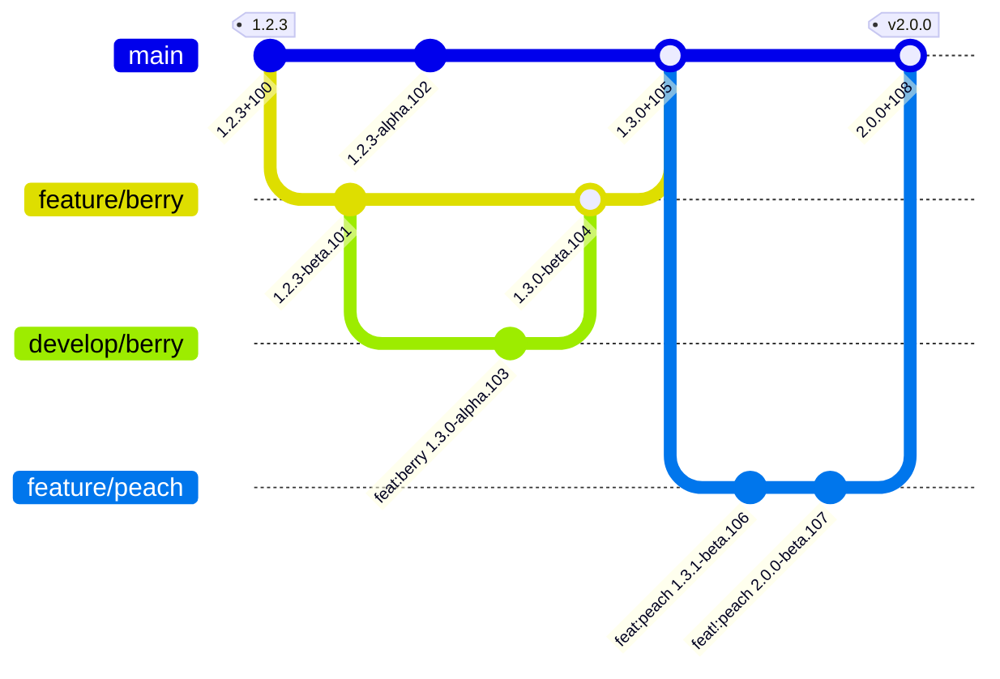

 

# NoeticTools.GitSemVer

Automatic true [Semmantic Versioning](https://semver.org/) for both **Visual Studio** and donet CLI builds of .NET solutions and projects.
Provides versioning _out of box_ and is fully customisable by by built-in C# scripting with a versioning API.

Just works on every <b>Visual Studio</b> or dotnet CLI build on every box.

[![Documentation Shield]](https://noetictools.github.io/Git2SemVer.MSBuild/)

An example git workflow from a release `1.2.3` to the next release `2.0.0`:

 

## License

`Git2SemVer` uses the [MIT license](https://choosealicense.com/licenses/mit/).

## Acknowledgments

This project uses the following tools and libraries. Many thanks to those who created and manage them.

* [Spectre.Console](https://github.com/spectreconsole/spectre.console)
* [Injectio](https://github.com/loresoft/Injectio)
* [JetBrains Annotations](https://www.jetbrains.com/help/resharper/Code_Analysis__Code_Annotations.html)
* [Semver](https://www.nuget.org/packages/Semver) - files copied to create subset
* [NuGet.Versioning](https://www.nuget.org/packages/NuGet.Versioning)
* [NUnit](https://www.nuget.org/packages/NUnit)
* [Moq](https://github.com/devlooped/moq)
* [docfx](https://dotnet.github.io/docfx/)
* <a href="https://www.flaticon.com/free-icons/brain" title="brain icons">Brain icons created by Freepik - Flaticon</a>

<!---------------------------------------------------------------------------->

[Documentation Shield]: https://img.shields.io/badge/See_the_full_documentation_here-37a779?style=for-the-badge

