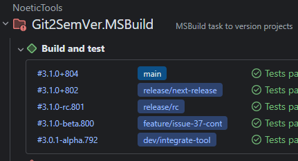

---
uid: teamcity
---

<div style="background-color:#944248;padding:0px;margin-bottom:0.5em">
  
</div>

[](https://www.nuget.org/packages/NoeticTools.Git2SemVer.MsBuild)
<a href="https://github.com/NoeticTools/Git2SemVer">
  
</a>

# TeamCity

[TeamCity](https://www.jetbrains.com/teamcity/) is a [controlled host](xref:glossary#controlled-host). A TeamCity server and its agents are seen as one host.

## Detection

Git2SemVer automatically detects when it is running on a TeamCity agent and uses the TeamCity build number.

## Build number

| Host property | Description  |
|:--            |:--           |
| Build number  | TeamCity provided build number `%build.counter%`. |
| Build context | '0'          |
| Build ID      | `<build number>`  |

Example versions: 
* `1.2.3-12345`
* `1.2.3-12345+3a962b33`
* `1.2.3+12345.3a962b33`

## Build labelling

On each Git2SemVer can set the TeamCity build label to the build version as shown below.



> [!IMPORTANT]
> To use build system build labelling it must first be enabled by setting the [MSBuild property](xref:msbuild-properties) `Git2SemVer_UpdateHostBuildLabel` to true.
> The default is `false` (disabled).

build system build labelling can be enabled on the build command line like this:

```
dotnet build -p:Git2SemVer_UpdateHostBuildLabel=true
```

Or, in the `csproj`, or `Directory.Build.props` file like:

```
<PropertyGroup>
      :
  <Git2SemVer_UpdateHostBuildLabel>true</Git2SemVer_UpdateHostBuildLabel>
      :
</PropertyGroup>
```

## Properties

The build host object's properties:

| Host property | Description      |
|:--            |:--               |
| Build number  | TeamCity's build number (%build.counter%). |
| Build context | '0'              |
| Build ID      | `<build number>` |
| IsControlled  | true             |
| Name          | 'TeamCity'       |

## Services

| Service               | Description     |
|:--                    |:--              |
| BumpBuildNumber       | Not supported.  |
| ReportBuildStatistic  | Supported. See [TeamCity - Reporting Build Statistics](https://www.jetbrains.com/help/teamcity/service-messages.html#Reporting+Build+Statistics). |
| SetBuildLabel         | Supported. See [TeamCity - Reporting Build Number](https://www.jetbrains.com/help/teamcity/service-messages.html#Reporting+Build+Number). |

Git2SemVer's default version generator will:

* Call `SetBuildLabel` with the generated build system version if [Git2SemVer_UpdateHostBuildLabel](xref:msbuild-properties##inputs) is set to true.
* Call `ReportBuildStatistic` with Git2SemVer's MSTask execution time.