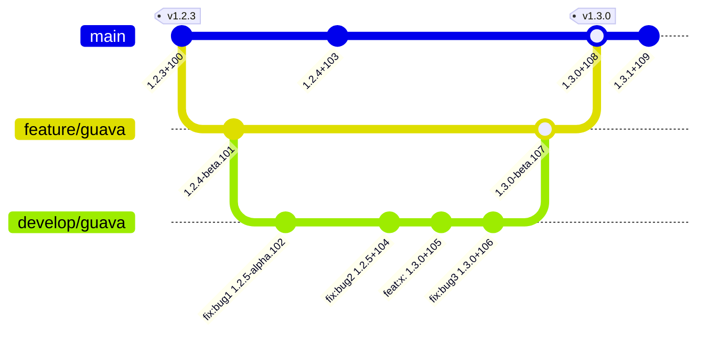

---
uid: workflow
---

  

## Workflow

### The workflow starting point

If the Git code repository does not have any release tags it is assumed that the project has not yet made a release. 
This is then a project in the [Semver initial development phase](https://semver.org/#how-should-i-deal-with-revisions-in-the-0yz-initial-development-phase) and the starting version is `0.1.0`.

If there has been a prior release the most recent releases that are directly reachable from the head commit should be marked with [release tags](xref:release-tagging). 
These tag defines the starting version for Git2SemVer. 
There is no benefit to adding tags for all prior releases in the repository's history.
Git2SemVer stops walking Git commits when it reaches a [release tags](xref:release-tagging).

### Guava example

An example workflow:

| Step    | Action                                        | Version | Explanation                                                 |
| :--:    |:--                                            | :--:    |:--                                                          |
| &#9312; | Start at a release (`1.2.3`) marked by tag `v1.2.3`. | **1.2.3**  | The tag defines this commit as the released version 1.2.3. The versioning release cycle starts from a tagget release.  |
| &#9313; | A commit without API changes                  | 1.2.4 | Bumped as a released version may not be reused. See [Semver spec, item 6](<see href="https://semver.org/#spec-item-6">)
| &#9314; | In a developer branch fix 2 bugs (e.g: [conventional commits](https://www.conventionalcommits.org/en/v1.0.0/) `fix:bug1` and `fix:bug2`). | 1.2.4 | No change as the patch number has already been bumped. Note: [Semver spec, item 6](https://semver.org/#spec-item-6) refers to "fixes" (plural). |
| &#9315; | Add a feature `feat:x`.                       | 1.3.0 | See [Semver item 7](https://semver.org/spec/v2.0.0.html#spec-item-7)     |
| &#9316; | Fix another bug `fix:bug3`.                   | 1.3.0 | See [Semver spec, item 7](https://semver.org/#spec-item-7). It is about changes between releases, not order of changes. |
| &#9317; | Merge the work to a feature branch and then the main branch and this build is released (commit is tagged with used version). | **1.3.0** | A release, the versioning release cycle starts again. |

An example of this worklow's git diagram:

### FAQ

**Can I rebuild a release tagged commit?**

Yes - Rebuilds of the commit with a release version tag will produce builds with the same released base version 
but with different build numbers in the full version metadata. So each build is uniquely identifiable.
However only one of these builds may be released as the released version number cannot be reused ([Semver spec, item 6](<see href="https://semver.org/#spec-item-6">)).

**Does the release need to be the most recent commit on the release branch**

No - If it is not the most recent then, after adding a [release tag](xref:release-tagging), rebuilding following commits will result in their versions following the released version according to semantic versioning rules.

## Related topics

* [Versioning](xref:versioning)
* [Branch naming](xref:branch-naming)
* [Build maturity identifier](xref:maturity-identifier)
* [Build properties](xref:msbuild-properties)
