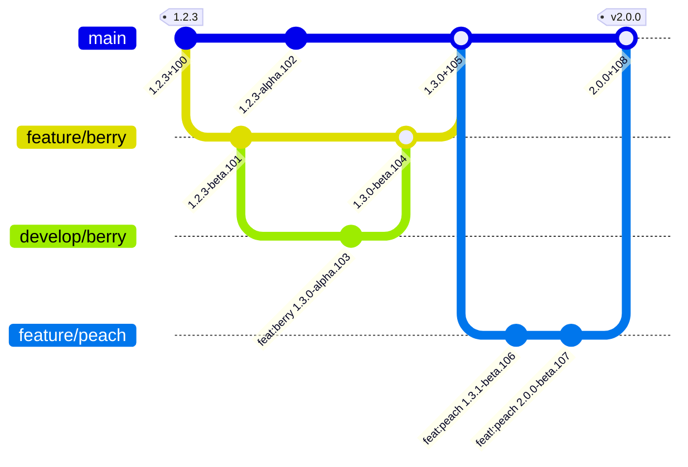

  

# Git2SemVer

No limits .NET solution versioning.

Git2SemVer is a Visual Studio and developer friendly <a href="https://semver.org">Semantic Versioning</a> framework for .NET solution and project versioning.
It works the same with both Visual Studio and dotnet CLI builds. 
Every build, on both developer boxes and the build system, get traceable build numbering (no commit counting).

This tool is for teams that:

* Can benefit from true <a href="https://semver.org">Semantic Versioning</a>.
* Uses <a href="https://www.conventionalcommits.org/en/v1.0.0/">Conventional Commits</a> to automatically generate change logs.
* Uses branches to separate releasable code from feature or under development code (e.g: GitHub flow or GitFlow). 
* Only releases builds from a build system (or controlled host).
* Wants to avoid custom build scripts, and tools, on a build system.
* Uses Visual Studio as well as dotnet CLI.
* Values full traceability for every build regardless if on a build system or an uncontrolled developer box (commit counts/depth will not do).
* Needs unique versioning customisation that the built-in C# scripting may provide.

## Quick introduction

You:
* Mark a release's commit by adding a [git tag](xref:release-tagging) like `v1.2.3`.
* Use [separate branches](xref:branch-naming) for building release and non-release commits.
* Use <a href="https://www.conventionalcommits.org/en/v1.0.0/">Conventional Commit</a> mesages like `fix: fixed crash on shutdown`
to mark commits with fixes, features, and/or breaking changes.

Git2SemVer automatically, on every build, provides:
* Semantic versioning:
  * File version
  * Assembly version
  * Informational version
  * Package version (NuGet package version)
  * Other MSBuild version properties
  * [Pre-release identifier](xref:maturity-identifier) like `alpha`/`beta`/`rc` (from branch name)
* [Build number](#build-number)
* Host adaptive version formating like:
  * Including machine name in semantic version metadata when building on a developer's box.
  * Different build number sources and formating on GitHub Workflow and TeamCity.

Git2SemVer also detects and executes an optional [C# script](xref:csharp-script). This script can change any part of the versioning.

It can be configured for any mix of solution versioning and individual project versioning without external build-time tools.
No build system version generation steps are needed, keeps developer and build environments simple and aligned.

An example git workflow from a release `1.2.3` to the next release `2.0.0`:

## Quick links

* [Getting Started](xref:getting-started)
* [Default Versioning](xref:versioning)
* Usage
  * [Workflow](xref:workflow)
  * [Release Tagging](xref:release-tagging)
  * [Branch naming](xref:branch-naming)
  * [Build Hosts](xref:build-hosts)
  * [C# Script](xref:csharp-script)

## Features

 

<table style="margin-left:0px; margin-right:auto; align:left">

<!-- Conventional Commits -->
<tr>
    <td class="iconcolumn">
      
    </td>
    <td class="featureBody" style="vertical-align:center; text-align:left">
        

           <a href="https://www.conventionalcommits.org/en/v1.0.0/">Conventional Commits</a>
        

        

            Use conventional commits to automate both changelog generation and get semantic versioning for free.
        

    </td>
</tr>

<!-- Visual studio -->
<tr>
    <td class="iconcolumn">
        
    </td>
    <td class="featureBody" style="vertical-align:center; text-align:left">
        

            Visual Studio and .NET developer friendly
        

        

            Versioning on every Visual Studio or dotnet CLI build without exernal tools. Just build.
        

    </td>
</tr>

<!-- Semver -->
<tr>
    <td class="iconcolumn">
      
    </td>
    <td class="featureBody" style="vertical-align:center; text-align:left">
        

          <a href="https://semver.org/">Semmantic Versioning</a>
        

        

           Industry standard Semmantic Version compliance.
        

        

           Supports <a href="https://noetictools.github.io/Git2SemVer.MSBuild/Reference/Glossary.html##initial-development">initial development versioning.</a> 
        

</tr>

<!-- Environmental Parity -->
<tr>
    <td class="iconcolumn">
      
    </td>
    <td class="featureBody" style="vertical-align:center; text-align:left">
        

            <a href="https://noetictools.github.io/Git2SemVer.MSBuild/Reference/Glossary.html##environment-parity">Environment Parity</a>
        

        

            Visual Studio, VS Code, and dotnet CLI are all the same to Git2SemVer.
            Build system and developer environments all get versioning without custom build steps, tools, or scripts.
        

    </td>
</tr>

<!-- Build Numbering -->
<tr>
    <td class="iconcolumn">
        
#

    </td>
    <td class="featureBody" style="vertical-align:center; text-align:left">
        

          <a href="https://noetictools.github.io/Git2SemVer.MSBuild/Reference/Glossary.html##build-number">
            Build Numbering
          </a>
        

        

            Automatic build numbering on all <b>developer boxes</b> and build system builds.
        

        

           Full traceability.
           <a href="https://noetictools.github.io/Git2SemVer.MSBuild/Reference/Glossary.html##build-height">Build height</a> <b>NOT</b> used.
        

    </td>
</tr>

<!-- C# -->
<tr>
    <td class="iconcolumn">
      
    </td>
    <td class="featureBody" style="vertical-align:center; text-align:left">
        

           <a href="https://noetictools.github.io/Git2SemVer.MSBuild/Usage/CSharpScripting/CSharpScript.html">C# Scripting</a>
        

        

           <b>No limits customisable</b> by built-in C# scripting with a versioning API.
        

    </td>
</tr>

<!-- Build Host Adaptive Versioning -->
<tr>
    <td class="iconcolumn">
      
    </td>
    <td class="featureBody" style="vertical-align:center; text-align:left">
        

           Build Host Adaptive Versioning
        

        
The versioning adapts according to the build host.

        
e.g: Automatically uses TeamCity build counter for build number and drops machine name metadata.

    </td>
</tr>

<!-- Workflow agnostic -->
<tr>
    <td class="iconcolumn">
      
    </td>
    <td class="featureBody" style="vertical-align:center; text-align:left">
        
Git Workflow Agnostic

        
No Git workflow configuration required. It works the same for GitFlow and GitHub Flow.

    </td>
</tr>

<!-- TeamCity -->
<tr>
    <td class="iconcolumn">
      
    </td>
    <td class="featureBody" style="vertical-align:center; text-align:left">
        

           <a href="https://noetictools.github.io/Git2SemVer.MSBuild/Usage/BuildHosts/TeamCity.html">
            TeamCity Integration
           </a>
        

        

           Automatic build system detection with server build number (label) updated with
           a build version specifically adapted for TeamCity.
         

         
    </td>
</tr>

<!-- GitHub Workflows -->
<tr>
    <td class="iconcolumn">
      
    </td>
    <td class="featureBody" style="vertical-align:center; text-align:left">
        

          <a href="https://noetictools.github.io/Git2SemVer.MSBuild/Usage/BuildHosts/GitHubWorkflows.html">
            GitHub Workflows
          </a>
        

        
Built in support for builds using GitHub Actions.

        
Constructs build number from run and run attempt numbers
        and adapts the version for GitHub builds.

        

    </td>
</tr>

</table>

 

 
## License

Git2SemVer uses the [MIT license](https://choosealicense.com/licenses/mit/).

## Acknowledgments

This project uses the following tools and libraries. Many thanks to those who created and manage them.

* [Spectre.Console](https://github.com/spectreconsole/spectre.console)
* [Injectio](https://github.com/loresoft/Injectio)
* [JetBrains Annotations](https://www.jetbrains.com/help/resharper/Code_Analysis__Code_Annotations.html)
* [TeamCity.ServiceMessages](https://github.com/JetBrains/TeamCity.ServiceMessages)
* [Semver](https://www.nuget.org/packages/Semver) - files copied to create subset
* [NuGet.Versioning](https://www.nuget.org/packages/NuGet.Versioning)
* [NUnit](https://www.nuget.org/packages/NUnit)
* [Moq](https://github.com/devlooped/moq)
* [docfx](https://dotnet.github.io/docfx/)
* [JsonPeek](https://www.clarius.org/json/)
* <a href="https://www.flaticon.com/free-icons/brain" title="brain icons">Brain icons created by Freepik - Flaticon</a>
* <a href="https://www.flaticon.com/free-icons/consistent" title="consistent icons">Consistent icons created by Freepik - Flaticon</a>
* <a href="https://www.flaticon.com/free-icons/programmer" title="programmer icons">Programmer icons created by Flowicon - Flaticon</a>
